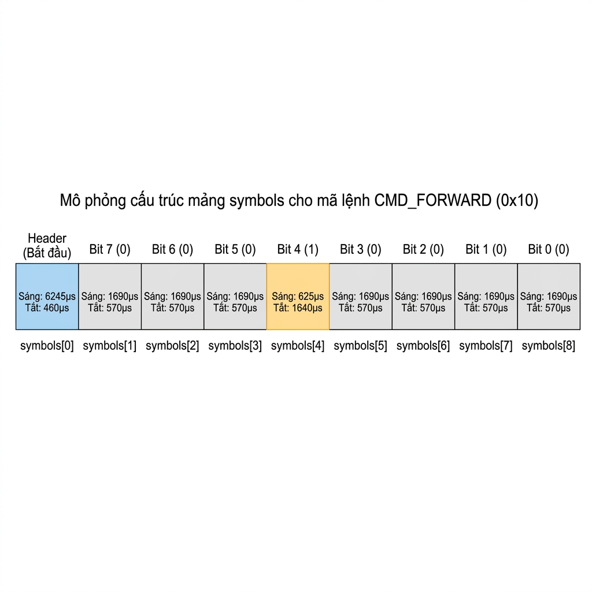

# Hướng Dẫn Tích Hợp Điều Khiển Robot Bằng Hồng Ngoại (IR) & Trợ Lý AI Xiaozhi

([Tiếng Việt](README.md) | [English](README_en.md) | [中文](README_zh.md) | [日本語](README_ja.md))

Tài liệu này là hướng dẫn thực hành từng bước giúp bạn tự tay đấu nối và lập trình hệ thống thu-phát hồng ngoại (IR) 38kHz trên nền tảng **ESP32-S3 Xiaozhi** để điều khiển robot đồ chơi (Robot cún) bằng giọng nói thông qua mô hình trí tuệ nhân tạo (AI).

---

## I. MỤC TIÊU DỰ ÁN

1.  **Giải mã remote gốc:** Bắt và phân tích tín hiệu hồng ngoại phát ra từ remote điều khiển gốc của robot cún để trích xuất tập lệnh HEX tương ứng.
2.  **Giả lập bộ điều khiển:** Lập trình ESP32-S3 phát sóng mang hồng ngoại 38kHz thay thế chiếc remote.
3.  **Tích hợp điều khiển giọng nói:** Liên kết lệnh hồng ngoại với công cụ MCP (Model Context Protocol) để khi bé ra lệnh (ví dụ: *"đi thẳng"*, *"quay trái"*), mô hình AI sẽ tự động kích hoạt robot di chuyển.
4.  **Tùy biến biểu cảm sinh động (Emoji & Theme):** Thiết kế và lập trình tích hợp bộ 21 biểu cảm khuôn mặt trong suốt độc quyền lên màn hình LCD TFT của robot, tự động hiển thị biểu cảm vui, buồn, ngạc nhiên... tương ứng theo trạng thái hội thoại và câu trả lời của AI.

---

## II. CHUẨN BỊ PHẦN CỨNG

Để hoàn thành dự án, bạn cần chuẩn bị các linh kiện phần cứng sau:
*   Bo mạch **ESP32-S3 WROOM-1 N16R8** (hoặc board chuyên dụng `bread-compact-wifi-s3cam`).
*   Mắt thu hồng ngoại **VS1838B** (dùng cho phần giải mã lệnh).
*   Đèn **LED phát hồng ngoại 5mm** kèm điện trở bảo vệ **100 Ohm**.
*   **Trọn bộ linh kiện Xiaozhi cơ bản:** Micro INMP441, Mạch giải mã âm thanh I2S MAX98357A, Loa 4 Ohm 3W, Màn hình TFT 1.54 inch ST7789, Pin LIPO 1000mAh, mạch sạc LIPO và công tắc gạt.

---

## III. CÁC BƯỚC TIẾN HÀNH

### PHẦN 1: GIẢI MÃ LỆNH ĐIỀU KHIỂN TỪ REMOTE GỐC

#### Bước 1: Nối dây mắt thu hồng ngoại VS1838B
Tiến hành kết nối mắt thu VS1838B vào bo mạch ESP32-S3 theo sơ đồ lắp đặt dưới đây:

<div align="center">
  
  <p><i>Sơ đồ nối mắt thu hồng ngoại và hiển thị log giải mã trên Serial Monitor qua cáp USB</i></p>
</div>

*   **Chân OUT (Tín hiệu):** Kết nối vào chân **GPIO42** (`IR_RX_GPIO`).
*   **Chân GND:** Nối vào chân Ground (GND).
*   **Chân VCC:** Nối vào nguồn **5V** (hoặc 3.3V).

#### Bước 2: Nạp code đọc log giải mã
Chúng ta sử dụng bộ ngắt GPIO trên ESP32 để đo chính xác thời gian xung thu được (tính bằng micro-giây - µs) và giải mã nhị phân.

Mã nguồn xử lý nằm trong tệp: **[main/boards/bread-compact-wifi-s3cam/ir_robot_controller.cc](file:///d:/project/xiaozhi-esp32-main/main/boards/bread-compact-wifi-s3cam/ir_robot_controller.cc)**

*   **Đo độ rộng xung (Dòng 51–65):** Đo thời gian bằng `esp_timer_get_time()` trong ngắt ISR và đẩy vào Queue.
*   **Gom frame và giải mã (Dòng 130–160):** Task `ir_rx_task` nhận tín hiệu, tự động phát hiện khoảng trống tĩnh `> 50ms` để tách các frame lệnh tiếp theo.
*   **Trích đoạn code in kết quả giải mã (Dòng 77–128 - Hàm `print_rx_result`):**
```cpp
// file: main/boards/bread-compact-wifi-s3cam/ir_robot_controller.cc
static void print_rx_result(pulse_t* buf, int count, int frame_num) {
    ESP_LOGI(TAG, "--- Frame #%d | So xung: %d ---", frame_num, count);
    ESP_LOGI(TAG, "  [i]  L_thu  L_exp  DeltaL  | H_thu  H_exp  DeltaH");
    // ... Vòng lặp so sánh độ rộng xung thực tế vs. cấu trúc xung tiêu chuẩn ...
    int code = 0;
    for (int i = 2, bit_idx = 0; i < count && bit_idx < 8; i += 2, bit_idx++) {
        if (buf[i].duration < 1000) {
            code |= (1 << (7 - bit_idx)); // Xác định bit 1
        }
    }
    ESP_LOGI(TAG, "  ==> Decoded: 0x%02X (%s)", code, GetCommandName(code));
}
```

#### Bước 3: Bấm các nút trên remote gốc để thu thập mã HEX
1.  Nạp code lên ESP32 bằng lệnh: `idf.py flash monitor`.
2.  Hướng remote điều khiển của robot cún vào mắt thu VS1838B và nhấn các nút (Tiến, Lùi, Trái, Phải...).
3.  Xem log in ra trên màn hình Terminal và ghi lại mã HEX của từng phím bấm phục vụ cho phần tiếp theo.

---

### PHẦN 2: THÊM LED PHÁT HỒNG NGOẠI ĐỂ ĐIỀU KHIỂN ROBOT DOG

#### Bước 1: Nối dây đèn LED phát hồng ngoại (IR LED)
Sau khi giải mã thành công, tháo mắt thu hồng ngoại ra và tiến hành lắp đặt mạch phát hoàn chỉnh bao gồm LED phát hồng ngoại nối tiếp điện trở 100 Ohm và các linh kiện âm thanh, màn hình của Xiaozhi theo sơ đồ sau:

<div align="center">
  
  <p><i>Sơ đồ mạch hoàn chỉnh tích hợp LED phát hồng ngoại (khoanh đỏ), màn hình LCD, Micro, Loa và Pin Lipo</i></p>
</div>

*   **Chân GPIO phát:** Cực dương (chân dài) của LED phát IR nối qua điện trở **100 Ohm** vào chân **GPIO46** (`IR_TX_GPIO`).
*   Cực âm (chân ngắn) của LED phát IR nối vào **GND**.

#### Bước 2: Nạp code phát lệnh hồng ngoại giả lập
Mã nguồn điều khiển phát hồng ngoại nằm trong tệp: **[main/boards/bread-compact-wifi-s3cam/ir_robot_controller.cc](file:///d:/project/xiaozhi-esp32-main/main/boards/bread-compact-wifi-s3cam/ir_robot_controller.cc)**

*   **Cấu hình kênh phát RMT (Dòng 478–500):** Cấu hình driver RMT phát sóng mang hồng ngoại ở tần số **38kHz**, duty cycle **33%**.

##### Quy ước mã hóa bit

Mỗi bit dữ liệu được mã hóa thành **1 cặp xung sáng/tắt** (carrier ON / carrier OFF) với thời gian cụ thể:

**Header (Xung mở đầu frame — cố định):**

| Trạng thái | Thời gian | Ý nghĩa |
| :--- | :--- | :--- |
| LED sáng (`level = 1`) | `TX_HDR_L = 6245 µs` | Báo hiệu bắt đầu frame mới |
| LED tắt (`level = 0`) | `TX_HDR_H = 460 µs` | Khoảng nghỉ phân tách |

**Data Bits (8 bit mã lệnh):**

| Giá trị bit | LED sáng (µs) | LED tắt (µs) | Đặc điểm nhận dạng |
| :--- | :--- | :--- | :--- |
| **Bit `0`** | `TX_BIT0_L = 1690` | `TX_BIT0_H = 570` | Sáng **lâu**, tắt **nhanh** |
| **Bit `1`** | `TX_BIT1_L = 625` | `TX_BIT1_H = 1640` | Sáng **nhanh**, tắt **lâu** |

> **Quy tắc phân biệt:** Bit `0` và Bit `1` có tổng thời gian gần bằng nhau (~2260 µs), nhưng **tỷ lệ sáng/tắt ngược nhau**. Đây là cách bộ giải mã trên Robot phân biệt giá trị của từng bit.

##### Hàm cốt lõi: `build_tx_frame`

Hàm này có nhiệm vụ **chuyển đổi 1 mã lệnh 8-bit thành mảng xung vật lý** sẵn sàng phát ra GPIO.

```c
static void build_tx_frame(rmt_symbol_word_t* symbols, dog_cmd_t cmd, bool is_first_frame)
{
    // [0] Header
    symbols[0].duration0 = TX_HDR_L;   // 6245µs — LED sáng
    symbols[0].level0    = 1;
    symbols[0].duration1 = TX_HDR_H;   // 460µs  — LED tắt
    symbols[0].level1    = 0;

    // [1]-[8] Data bits (8 bit, MSB first)
    for (int i = 0; i < 8; i++) {
        bool bit_val = is_first_frame && ((cmd >> (7 - i)) & 1);
        if (bit_val) {
            symbols[1 + i].duration0 = TX_BIT1_L;  // 625µs  — sáng nhanh
            symbols[1 + i].level0    = 1;
            symbols[1 + i].duration1 = TX_BIT1_H;  // 1640µs — tắt lâu
            symbols[1 + i].level1    = 0;
        } else {
            symbols[1 + i].duration0 = TX_BIT0_L;  // 1690µs — sáng lâu
            symbols[1 + i].level0    = 1;
            symbols[1 + i].duration1 = TX_BIT0_H;  // 570µs  — tắt nhanh
            symbols[1 + i].level1    = 0;
        }
    }
}
```

**Đầu vào của hàm:**

| Tham số | Kiểu | Ý nghĩa |
| :--- | :--- | :--- |
| `symbols` | `rmt_symbol_word_t*` | Con trỏ tới mảng 9 phần tử, mỗi phần tử mô tả 1 cặp xung sáng/tắt. Hàm ghi trực tiếp vào mảng này (không cần `return`). |
| `cmd` | `dog_cmd_t` | Mã lệnh 8-bit cần phát. Ví dụ: `CMD_FORWARD = 0x10` (Tiến), `CMD_LEFT = 0x0D` (Trái). |
| `is_first_frame` | `bool` | `true` = frame lệnh thật (mã hóa đúng giá trị `cmd`). `false` = frame lặp (toàn bộ 8 bit đều thành `0`). |

**Mảng `symbols` — Cấu trúc và cách lưu giá trị:**

Mảng gồm **9 phần tử**, kiểu `rmt_symbol_word_t` — là kiểu dữ liệu riêng của driver RMT (ESP-IDF), mỗi phần tử lưu trữ **1 cặp xung**:

```
symbols[0]              → Header (xung mở đầu frame)
symbols[1] → symbols[8] → 8 bit dữ liệu của mã lệnh (MSB → LSB)
```

Mỗi phần tử `rmt_symbol_word_t` chứa 4 trường:

| Trường | Ý nghĩa |
| :--- | :--- |
| `duration0` | Thời gian (µs) của **nửa đầu** — giai đoạn LED **sáng** |
| `level0` | Mức logic nửa đầu — luôn bằng `1` (sáng) |
| `duration1` | Thời gian (µs) của **nửa sau** — giai đoạn LED **tắt** |
| `level1` | Mức logic nửa sau — luôn bằng `0` (tắt) |

**Ví dụ trích xuất bit:** `cmd = CMD_FORWARD = 0x10 = 0b00010000`

| Vòng lặp `i` | Bit lấy ra (vị trí `7-i`) | Giá trị | Timing được ghi |
| :--- | :--- | :--- | :--- |
| `i = 0` | Bit 7 | `0` | Sáng 1690 µs, Tắt 570 µs |
| `i = 1` | Bit 6 | `0` | Sáng 1690 µs, Tắt 570 µs |
| `i = 2` | Bit 5 | `0` | Sáng 1690 µs, Tắt 570 µs |
| `i = 3` | Bit 4 | **`1`** | **Sáng 625 µs, Tắt 1640 µs** |
| `i = 4` | Bit 3 | `0` | Sáng 1690 µs, Tắt 570 µs |
| `i = 5` | Bit 2 | `0` | Sáng 1690 µs, Tắt 570 µs |
| `i = 6` | Bit 1 | `0` | Sáng 1690 µs, Tắt 570 µs |
| `i = 7` | Bit 0 | `0` | Sáng 1690 µs, Tắt 570 µs |

Để trực quan, mảng xung `symbols[9]` được phân bổ cụ thể trong bộ nhớ như hình vẽ dưới đây:

<div align="center">
  
  <p><i>Mô phỏng 9 phần tử trong mảng symbols mã hóa cho lệnh đi thẳng (CMD_FORWARD), làm nổi bật bit 4 mang giá trị 1</i></p>
</div>

##### Phát ra GPIO bằng RMT

Mảng `symbols` sau khi được `build_tx_frame` ghi đầy đủ sẽ được đưa thẳng cho ngoại vi phần cứng **RMT** của ESP32 để phát ra chân GPIO:

```c
rmt_symbol_word_t frame[9];                  // Tạo mảng 9 ô trống
build_tx_frame(frame, CMD_FORWARD, true);    // Ghi timing vào mảng

// Đưa mảng cho phần cứng RMT để tự động phát ra GPIO
rmt_transmit(s_tx_channel, s_copy_encoder, frame, sizeof(frame), &tx_cfg);

// Đợi phần cứng phát xong toàn bộ 9 cặp xung
rmt_tx_wait_all_done(s_tx_channel, portMAX_DELAY);
```

**Luồng xử lý:**

```
build_tx_frame()  →  rmt_transmit()  →  Phần cứng RMT  →  GPIO46  →  LED hồng ngoại  →  Robot Dog
   (phần mềm)         (giao cho HW)      (tự động phát)    (chân phát)    (phát tia IR)     (nhận lệnh)
```

> **Điểm mấu chốt:** Sau khi gọi `rmt_transmit()`, CPU hoàn toàn rảnh tay. Ngoại vi phần cứng RMT sẽ tự động đọc từng phần tử trong mảng `symbols` và bật/tắt chân GPIO46 đúng theo thời gian đã ghi — tạo ra tín hiệu hồng ngoại thực sự phát ra ngoài không gian mà **không cần CPU can thiệp**.

##### Bảng mã lệnh đầy đủ

| Lệnh | Mã nhị phân | Mã HEX | Mô tả |
| :--- | :--- | :--- | :--- |
| `CMD_FORWARD` | `0b00010000` | `0x10` | Tiến (bánh xe) |
| `CMD_BACKWARD` | `0b00001010` | `0x0A` | Lùi (bánh xe) |
| `CMD_LEFT` | `0b00001101` | `0x0D` | Quay trái (bánh xe) |
| `CMD_RIGHT` | `0b00001001` | `0x09` | Quay phải (bánh xe) |
| `CMD_MUSIC` | `0b00000110` | `0x06` | Mở nhạc |
| `CMD_STEP_FORWARD` | `0b00000111` | `0x07` | Tiến bước (chân + bánh) |
| `CMD_STEP_LEFT` | `0b00010001` | `0x11` | Trái từng bước |
| `CMD_STEP_BACKWARD` | `0b00010010` | `0x12` | Lùi từng bước |
| `CMD_STEP_RIGHT` | `0b00001000` | `0x08` | Phải từng bước |
| `CMD_TOGGLE` | `0b00001011` | `0x0B` | Ngồi ↔ Đứng |
| `CMD_STRETCH` | `0b00010011` | `0x13` | Duỗi chân |
| `CMD_HALT` | `0b00001111` | `0x0F` | Dừng lại |

*   **Đăng ký công cụ MCP (Dòng 527–621):** Định nghĩa công cụ `self.robot.move` và `self.robot.perform` (chuỗi nhảy múa biểu diễn) giúp AI nhận diện và gọi lệnh tự động.

#### Bước 3: Thử nghiệm ra lệnh giọng nói
Khởi động hệ thống, đánh thức robot và thử ra lệnh: *"Đi thẳng lên phía trước"*, *"Bật nhạc lên"*, hoặc *"Hãy biểu diễn nhảy múa đi"*. Hãy quan sát xem cún robot có di chuyển và phản hồi chính xác theo lệnh của AI hay không.

---

### PHẦN 3: THÊM BỘ BIỂU CẢM TÙY CHỈNH LÊN MÀN HÌNH ROBOT

Ngoài việc điều khiển di chuyển, robot cún còn có một màn hình LCD nhỏ gắn ở ngực. Bạn có thể tự thiết kế bộ "khuôn mặt" riêng (vui, buồn, ngạc nhiên, giận dữ...) để robot hiển thị tự động theo cảm xúc khi trò chuyện với AI.

<div align="center">
  
  <p><i>Ví dụ: Bộ 21 biểu cảm chú khủng long xanh dễ thương được thiết kế tùy chỉnh cho robot</i></p>
</div>

#### Bước 1: Vẽ hoặc tải 21 bức ảnh biểu cảm
Xiaozhi hỗ trợ **21 trạng thái cảm xúc**. Bạn cần chuẩn bị 21 bức ảnh tương ứng, đặt tên theo đúng quy ước:

| STT | Tên file | Ý nghĩa | STT | Tên file | Ý nghĩa |
|:---:|:---|:---|:---:|:---|:---|
| 1 | `happy.png` | Vui vẻ | 12 | `loving.png` | Yêu thương |
| 2 | `sad.png` | Buồn | 13 | `neutral.png` | Bình thường |
| 3 | `angry.png` | Giận dữ | 14 | `relaxed.png` | Thư giãn |
| 4 | `crying.png` | Khóc | 15 | `shocked.png` | Sốc |
| 5 | `laughing.png` | Cười lớn | 16 | `silly.png` | Ngớ ngẩn |
| 6 | `sleepy.png` | Buồn ngủ | 17 | `cool.png` | Ngầu |
| 7 | `surprised.png` | Ngạc nhiên | 18 | `confident.png` | Tự tin |
| 8 | `thinking.png` | Suy nghĩ | 19 | `confused.png` | Bối rối |
| 9 | `winking.png` | Nháy mắt | 20 | `delicious.png` | Ngon |
| 10 | `kissy.png` | Hôn | 21 | `embarrassed.png` | Xấu hổ |
| 11 | `funny.png` | Hài hước | | | |

> **Mẹo:** Ảnh nên ở định dạng **PNG nền trong suốt** (xóa nền trắng) để khi hiện trên màn hình LCD nền đen sẽ đẹp hơn. Bạn có thể dùng các công cụ xóa nền online miễn phí như **remove.bg** hoặc thư viện Python `rembg`.

#### Bước 2: Bỏ ảnh vào đúng thư mục
Tạo một thư mục mới (ví dụ đặt tên là `my_theme`) và bỏ toàn bộ 21 bức ảnh vào đó. Ví dụ:
```
C:\Users\ngoma\Downloads\my_theme\
├── happy.png
├── sad.png
├── angry.png
├── ... (21 ảnh)
```

#### Bước 3: Sửa code để nhận diện bộ ảnh mới
Cần sửa **4 file** trong dự án (xem chi tiết đầy đủ tại [docs/custom-emoji-theme.md](docs/custom-emoji-theme.md)):

| File cần sửa | Việc cần làm |
|:---|:---|
| `main/display/lcd_display.cc` | Đặt tên và chọn màu giao diện cho theme mới |
| `main/assets.cc` | Thêm code đọc ảnh từ bộ nhớ vào theme |
| `scripts/build_default_assets.py` | Thêm tham số nhận thư mục ảnh mới |
| `main/CMakeLists.txt` | Chỉ đường dẫn tới thư mục ảnh trên máy tính |

#### Bước 4: Build và nạp code lên ESP32
```powershell
# Xóa file đóng gói cũ (bắt buộc để hệ thống đóng gói lại ảnh mới)
Remove-Item -Path build/generated_assets.bin -ErrorAction SilentlyContinue

# Biên dịch và nạp code
idf.py build flash
```

#### Bước 5: Thử nghiệm
Nói với robot: *"Hãy đổi sang giao diện my_theme"* — màn hình LCD sẽ chuyển sang hiển thị bộ biểu cảm do bạn tự tay thiết kế!

---


## IV. KẾT QUẢ ĐẠT ĐƯỢC

<div align="center">
  
  <p><i>Minh họa: Bé ra lệnh bằng giọng nói để điều khiển chú chó robot di chuyển</i></p>
</div>

### 1. Bảng mã hóa lệnh giải mã thành công (HEX)
Dưới đây là tập lệnh đã giải mã thành công từ chiếc remote gốc của robot cún:

| STT | Tên Lệnh | Mã HEX | Cú Pháp Lệnh Nhị Phân | Mô Tả Hành Động |
| :---: | :--- | :---: | :---: | :--- |
| 1 | **Tiến** | `0x10` | `00010000` | Chạy tiến lên bằng bánh xe |
| 2 | **Lùi** | `0x0A` | `00001010` | Chạy lùi lại bằng bánh xe |
| 3 | **Quay trái** | `0x0D` | `00001101` | Xoay tròn sang trái |
| 4 | **Quay phải** | `0x09` | `00001001` | Xoay tròn sang phải |
| 5 | **Bật/Tắt Nhạc** | `0x0C` | `00001100` | Kích hoạt loa phát nhạc của cún |
| 6 | **Đứng / Ngồi** | `0x0B` | `00001011` | Chuyển đổi tư thế (Toggle) |
| 7 | **Duỗi chân** | `0x13` | `00010011` | Co duỗi thẳng các khớp chân |
| 8 | **Dừng lại** | `0x0F` | `00001111` | Ngắt toàn bộ hành động ngay lập tức |

---

### 2. Báo cáo đo lường độ trễ phản hồi của hệ thống
Hệ thống hoạt động ổn định với thời gian xử lý và phản hồi thực tế đo được qua Serial log như sau:

#### Bảng A: Đo độ trễ đối với lệnh đơn lẻ (Ví dụ: "Đi tiến lên", "Rẽ trái đi")

| Lần thử | Thu âm giọng nói (ms) | AI phân tích ý định (ms) | Gửi gói tin qua mạng (ms) | ESP32 phát lệnh IR (ms) | Tổng độ trễ toàn hệ thống (ms) |
| :---: | :---: | :---: | :---: | :---: | :---: |
| 1 | 820 | 1150 | 180 | 1000 | **3150** |
| 2 | 780 | 1200 | 210 | 1000 | **3190** |
| 3 | 850 | 1100 | 190 | 1000 | **3140** |
| 4 | 800 | 1320 | 170 | 1000 | **3290** |
| 5 | 810 | 1180 | 200 | 1000 | **3190** |
| **Trung bình** | **812.0** | **1190.0** | **190.0** | **1000.0** | **3192.0 ms (~3.19 giây)** |

#### Bảng B: Đo độ trễ đối với chuỗi lệnh biểu diễn (Ví dụ: "Hãy biểu diễn đi" - Chạy combo nhảy múa)

| Lần thử | Thu âm giọng nói (ms) | AI phân tích ý định (ms) | Gửi gói tin qua mạng (ms) | Thực thi chuỗi nhảy múa (ms) | Tổng độ trễ hoàn thành (ms) |
| :---: | :---: | :---: | :---: | :---: | :---: |
| 1 | 850 | 1480 | 190 | 15000 (Toàn bộ bài nhảy) | **17520** |
| 2 | 810 | 1550 | 200 | 15000 (Toàn bộ bài nhảy) | **17560** |
| 3 | 830 | 1420 | 180 | 15000 (Toàn bộ bài nhảy) | **17430** |
| **Trung bình** | **830.0** | **1483.3** | **190.0** | **15000.0** | **17503.3 ms (~17.5 giây)** |

*(Lưu ý: Thời gian phát lệnh hồng ngoại đơn lẻ cố định là 1000ms vì ESP32 phải duy trì phát liên tục 9 frame xung hồng ngoại cách nhau 120ms để robot cún nhận diện lệnh nhạy nhất. Chuỗi lệnh biểu diễn mất trung bình 15 giây vì cún thực hiện tuần tự nhiều hành động: bật nhạc, gật đầu, duỗi chân, tiến, xoay vòng rồi đứng ngồi chào mừng).*

---

### 3. Kết quả tích hợp bộ biểu cảm tùy chỉnh (Emoji & Theme)

Bộ 21 biểu cảm chú khủng long xanh đã được tích hợp thành công lên màn hình LCD TFT 1.54 inch của robot. Kết quả đạt được:

*   ✅ **21/21 biểu cảm** hiển thị đúng trạng thái, ảnh trong suốt nền đen sắc nét trên màn hình LCD.
*   ✅ **Tự động chuyển đổi biểu cảm** theo nội dung hội thoại với AI (ví dụ: AI kể chuyện vui → robot hiển thị mặt `laughing`, AI nói lời buồn → robot hiển thị mặt `sad`).
*   ✅ **Chuyển đổi theme bằng giọng nói:** Ra lệnh *"Hãy đổi sang giao diện khủng long"* → robot tự động đổi toàn bộ bộ biểu cảm.
*   ✅ **Ảnh được tự động crop và resize** về kích thước chuẩn 200×200 pixels bởi script Python, đảm bảo nằm chính giữa màn hình không bị méo.

| Tiêu chí | Kết quả |
|:---|:---|
| Số lượng biểu cảm tích hợp | 21/21 ✅ |
| Định dạng ảnh | PNG trong suốt (nền đen LCD) |
| Độ phân giải hiển thị | 200 × 200 pixels |
| Chuyển biểu cảm theo cảm xúc AI | Hoạt động ổn định ✅ |
| Đổi theme bằng giọng nói | Hoạt động ổn định ✅ |