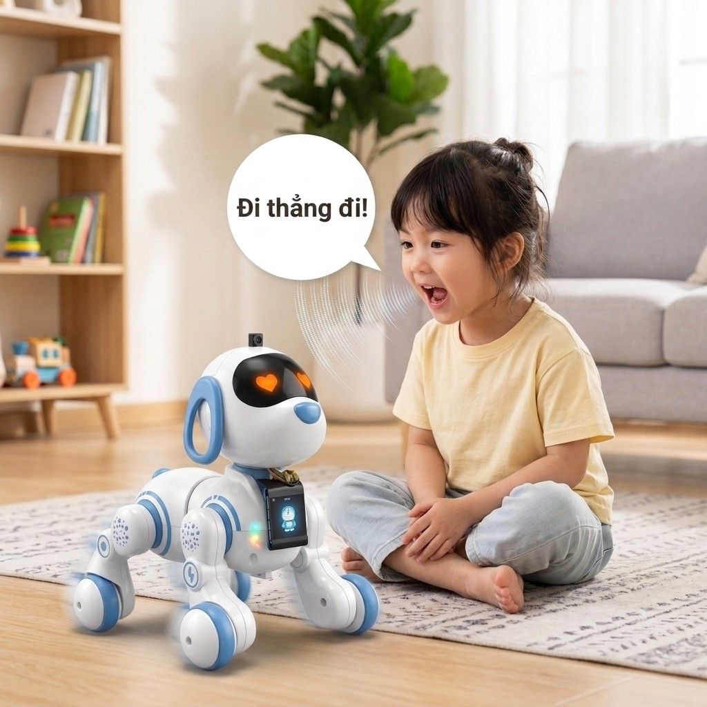

# Hướng Dẫn Tích Hợp Điều Khiển Robot Bằng Hồng Ngoại (IR) & Trợ Lý AI Xiaozhi

([Tiếng Việt](README.md) | [English](README_en.md) | [中文](README_zh.md) | [日本語](README_ja.md))

Tài liệu này là hướng dẫn thực hành từng bước giúp bạn tự tay đấu nối và lập trình hệ thống thu-phát hồng ngoại (IR) 38kHz trên nền tảng **ESP32-S3 Xiaozhi** để điều khiển robot đồ chơi (Robot cún) bằng giọng nói thông qua mô hình trí tuệ nhân tạo (AI).

---

## I. MỤC TIÊU DỰ ÁN

1.  **Giải mã remote gốc:** Bắt và phân tích tín hiệu hồng ngoại phát ra từ remote điều khiển gốc của robot cún để trích xuất tập lệnh HEX tương ứng.
2.  **Giả lập bộ điều khiển:** Lập trình ESP32-S3 phát sóng mang hồng ngoại 38kHz thay thế chiếc remote.
3.  **Tích hợp điều khiển giọng nói:** Liên kết lệnh hồng ngoại với công cụ MCP (Model Context Protocol) để khi bé ra lệnh (ví dụ: *"đi thẳng"*, *"quay trái"*), mô hình AI sẽ tự động kích hoạt robot di chuyển.

---

## II. CHUẨN BỊ PHẦN CỨNG

Để hoàn thành dự án, bạn cần chuẩn bị các linh kiện phần cứng sau:
*   Bo mạch **ESP32-S3 WROOM-1 N16R8** (hoặc board chuyên dụng `bread-compact-wifi-s3cam`).
*   Mắt thu hồng ngoại **VS1838B** (dùng cho phần giải mã lệnh).
*   Đèn **LED phát hồng ngoại 5mm** kèm điện trở bảo vệ **100 Ohm**.
*   **Trọn bộ linh kiện Xiaozhi cơ bản:** Micro INMP441, Mạch giải mã âm thanh I2S MAX98357A, Loa 4 Ohm 3W, Màn hình TFT 1.54 inch ST7789, Pin LIPO 1000mAh, mạch sạc LIPO và công tắc gạt.

---

## III. CÁC BƯỚC TIẾN HÀNH

### PHẦN 1: GIẢI MÃ LỆNH ĐIỀU KHIỂN TỪ REMOTE GỐC

#### Bước 1: Nối dây mắt thu hồng ngoại VS1838B
Tiến hành kết nối mắt thu VS1838B vào bo mạch ESP32-S3 theo sơ đồ lắp đặt dưới đây:

<div align="center">
  
  <p><i>Sơ đồ nối mắt thu hồng ngoại và hiển thị log giải mã trên Serial Monitor qua cáp USB</i></p>
</div>

*   **Chân OUT (Tín hiệu):** Kết nối vào chân **GPIO42** (`IR_RX_GPIO`).
*   **Chân GND:** Nối vào chân Ground (GND).
*   **Chân VCC:** Nối vào nguồn **5V** (hoặc 3.3V).

#### Bước 2: Nạp code đọc log giải mã
Chúng ta sử dụng bộ ngắt GPIO trên ESP32 để đo chính xác thời gian xung thu được (tính bằng micro-giây - µs) và giải mã nhị phân.

Mã nguồn xử lý nằm trong tệp: **[main/boards/bread-compact-wifi-s3cam/ir_robot_controller.cc](file:///d:/project/xiaozhi-esp32-main/main/boards/bread-compact-wifi-s3cam/ir_robot_controller.cc)**

*   **Đo độ rộng xung (Dòng 51–65):** Đo thời gian bằng `esp_timer_get_time()` trong ngắt ISR và đẩy vào Queue.
*   **Gom frame và giải mã (Dòng 130–160):** Task `ir_rx_task` nhận tín hiệu, tự động phát hiện khoảng trống tĩnh `> 50ms` để tách các frame lệnh tiếp theo.
*   **Trích đoạn code in kết quả giải mã (Dòng 77–128 - Hàm `print_rx_result`):**
```cpp
// file: main/boards/bread-compact-wifi-s3cam/ir_robot_controller.cc
static void print_rx_result(pulse_t* buf, int count, int frame_num) {
    ESP_LOGI(TAG, "--- Frame #%d | So xung: %d ---", frame_num, count);
    ESP_LOGI(TAG, "  [i]  L_thu  L_exp  DeltaL  | H_thu  H_exp  DeltaH");
    // ... Vòng lặp so sánh độ rộng xung thực tế vs. cấu trúc xung tiêu chuẩn ...
    int code = 0;
    for (int i = 2, bit_idx = 0; i < count && bit_idx < 8; i += 2, bit_idx++) {
        if (buf[i].duration < 1000) {
            code |= (1 << (7 - bit_idx)); // Xác định bit 1
        }
    }
    ESP_LOGI(TAG, "  ==> Decoded: 0x%02X (%s)", code, GetCommandName(code));
}
```

#### Bước 3: Bấm các nút trên remote gốc để thu thập mã HEX
1.  Nạp code lên ESP32 bằng lệnh: `idf.py flash monitor`.
2.  Hướng remote điều khiển của robot cún vào mắt thu VS1838B và nhấn các nút (Tiến, Lùi, Trái, Phải...).
3.  Xem log in ra trên màn hình Terminal và ghi lại mã HEX của từng phím bấm phục vụ cho phần tiếp theo.

---

### PHẦN 2: THÊM LED PHÁT HỒNG NGOẠI ĐỂ ĐIỀU KHIỂN ROBOT DOG

#### Bước 1: Nối dây đèn LED phát hồng ngoại (IR LED)
Sau khi giải mã thành công, tháo mắt thu hồng ngoại ra và tiến hành lắp đặt mạch phát hoàn chỉnh bao gồm LED phát hồng ngoại nối tiếp điện trở 100 Ohm và các linh kiện âm thanh, màn hình của Xiaozhi theo sơ đồ sau:

<div align="center">
  
  <p><i>Sơ đồ mạch hoàn chỉnh tích hợp LED phát hồng ngoại (khoanh đỏ), màn hình LCD, Micro, Loa và Pin Lipo</i></p>
</div>

*   **Chân GPIO phát:** Cực dương (chân dài) của LED phát IR nối qua điện trở **100 Ohm** vào chân **GPIO46** (`IR_TX_GPIO`).
*   Cực âm (chân ngắn) của LED phát IR nối vào **GND**.

#### Bước 2: Nạp code phát lệnh hồng ngoại giả lập
Mã nguồn điều khiển phát hồng ngoại nằm trong tệp: **[main/boards/bread-compact-wifi-s3cam/ir_robot_controller.cc](file:///d:/project/xiaozhi-esp32-main/main/boards/bread-compact-wifi-s3cam/ir_robot_controller.cc)**

*   **Cấu hình kênh phát RMT (Dòng 478–500):** Cấu hình driver RMT phát sóng mang hồng ngoại ở tần số **38kHz**, duty cycle **33%**.
*   **Trích đoạn code phát 9 frame lệnh (Dòng 326–373 - Hàm `send_ir_command`):**
```cpp
// file: main/boards/bread-compact-wifi-s3cam/ir_robot_controller.cc
static void send_ir_command(dog_cmd_t cmd) {
    rmt_symbol_word_t frame[9];
    rmt_transmit_config_t tx_cfg = { .loop_count = 0 };

    for (int n = 1; n <= 9; n++) {
        build_tx_frame(frame, cmd, (n == 1)); // Chỉ frame 1 mang mã lệnh, frame sau là repeat (bit 0)
        rmt_transmit(s_tx_channel, s_copy_encoder, frame, sizeof(frame), &tx_cfg);
        rmt_tx_wait_all_done(s_tx_channel, portMAX_DELAY);
        if (n < 9) vTaskDelay(pdMS_TO_TICKS(120)); // Khoảng cách giữa các frame lặp lại
    }
}
```
*   **Đăng ký công cụ MCP (Dòng 527–621):** Định nghĩa công cụ `self.robot.move` và `self.robot.perform` (chuỗi nhảy múa biểu diễn) giúp AI nhận diện và gọi lệnh tự động.

#### Bước 3: Thử nghiệm ra lệnh giọng nói
Khởi động hệ thống, đánh thức robot và thử ra lệnh: *"Đi thẳng lên phía trước"*, *"Bật nhạc lên"*, hoặc *"Hãy biểu diễn nhảy múa đi"*. Hãy quan sát xem cún robot có di chuyển và phản hồi chính xác theo lệnh của AI hay không.

---

## IV. KẾT QUẢ ĐẠT ĐƯỢC

<div align="center">
  
  <p><i>Minh họa: Bé ra lệnh bằng giọng nói để điều khiển chú chó robot di chuyển</i></p>
</div>

### 1. Bảng mã hóa lệnh giải mã thành công (HEX)
Dưới đây là tập lệnh đã giải mã thành công từ chiếc remote gốc của robot cún:

| STT | Tên Lệnh | Mã HEX | Cú Pháp Lệnh Nhị Phân | Mô Tả Hành Động |
| :---: | :--- | :---: | :---: | :--- |
| 1 | **Tiến** | `0x10` | `00010000` | Chạy tiến lên bằng bánh xe |
| 2 | **Lùi** | `0x0A` | `00001010` | Chạy lùi lại bằng bánh xe |
| 3 | **Quay trái** | `0x0D` | `00001101` | Xoay tròn sang trái |
| 4 | **Quay phải** | `0x09` | `00001001` | Xoay tròn sang phải |
| 5 | **Bật/Tắt Nhạc** | `0x0C` | `00001100` | Kích hoạt loa phát nhạc của cún |
| 6 | **Đứng / Ngồi** | `0x0B` | `00001011` | Chuyển đổi tư thế (Toggle) |
| 7 | **Duỗi chân** | `0x13` | `00010011` | Co duỗi thẳng các khớp chân |
| 8 | **Dừng lại** | `0x0F` | `00001111` | Ngắt toàn bộ hành động ngay lập tức |

---

### 2. Báo cáo đo lường độ trễ phản hồi của hệ thống
Hệ thống hoạt động ổn định với thời gian xử lý và phản hồi thực tế đo được qua Serial log như sau:

#### Bảng A: Đo độ trễ đối với lệnh đơn lẻ (Ví dụ: "Đi tiến lên", "Rẽ trái đi")

| Lần thử | Thu âm giọng nói (ms) | AI phân tích ý định (ms) | Gửi gói tin qua mạng (ms) | ESP32 phát lệnh IR (ms) | Tổng độ trễ toàn hệ thống (ms) |
| :---: | :---: | :---: | :---: | :---: | :---: |
| 1 | 820 | 1150 | 180 | 1000 | **3150** |
| 2 | 780 | 1200 | 210 | 1000 | **3190** |
| 3 | 850 | 1100 | 190 | 1000 | **3140** |
| 4 | 800 | 1320 | 170 | 1000 | **3290** |
| 5 | 810 | 1180 | 200 | 1000 | **3190** |
| **Trung bình** | **812.0** | **1190.0** | **190.0** | **1000.0** | **3192.0 ms (~3.19 giây)** |

#### Bảng B: Đo độ trễ đối với chuỗi lệnh biểu diễn (Ví dụ: "Hãy biểu diễn đi" - Chạy combo nhảy múa)

| Lần thử | Thu âm giọng nói (ms) | AI phân tích ý định (ms) | Gửi gói tin qua mạng (ms) | Thực thi chuỗi nhảy múa (ms) | Tổng độ trễ hoàn thành (ms) |
| :---: | :---: | :---: | :---: | :---: | :---: |
| 1 | 850 | 1480 | 190 | 15000 (Toàn bộ bài nhảy) | **17520** |
| 2 | 810 | 1550 | 200 | 15000 (Toàn bộ bài nhảy) | **17560** |
| 3 | 830 | 1420 | 180 | 15000 (Toàn bộ bài nhảy) | **17430** |
| **Trung bình** | **830.0** | **1483.3** | **190.0** | **15000.0** | **17503.3 ms (~17.5 giây)** |

*(Lưu ý: Thời gian phát lệnh hồng ngoại đơn lẻ cố định là 1000ms vì ESP32 phải duy trì phát liên tục 9 frame xung hồng ngoại cách nhau 120ms để robot cún nhận diện lệnh nhạy nhất. Chuỗi lệnh biểu diễn mất trung bình 15 giây vì cún thực hiện tuần tự nhiều hành động: bật nhạc, gật đầu, duỗi chân, tiến, xoay vòng rồi đứng ngồi chào mừng).*