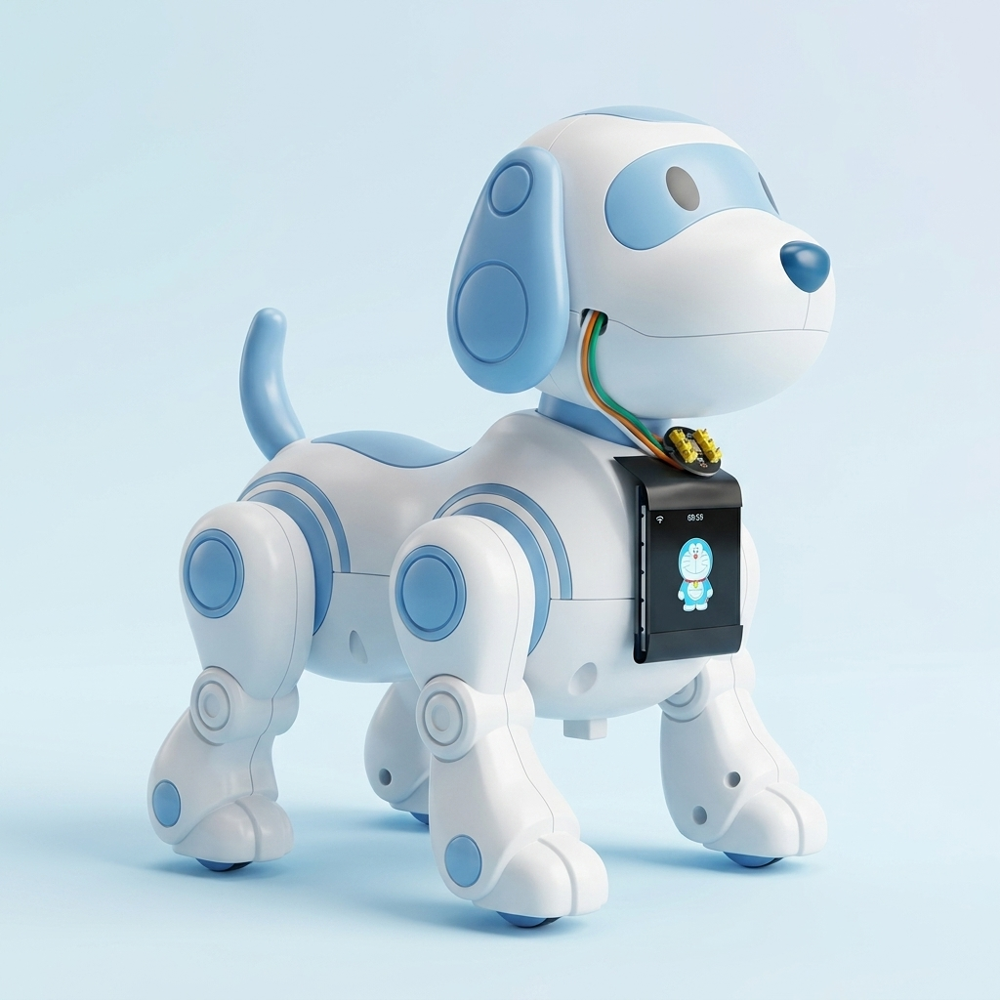
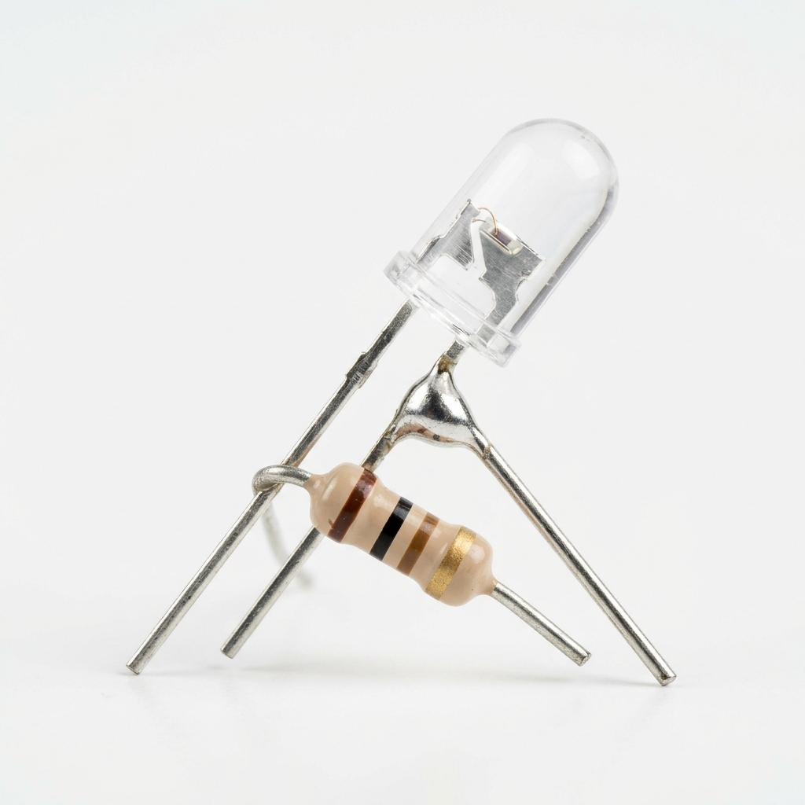

# Dự Án Tích Hợp Hồng Ngoại (IR) Điều Khiển Robot Đồ Chơi Qua Trợ Lý AI Xiaozhi

([Tiếng Việt](README.md) | [English](README_en.md) | [中文](README_zh.md) | [日本語](README_ja.md))

Tài liệu này tổng hợp toàn bộ thông tin dự án, sơ đồ đấu nối phần cứng, giao thức IR, thuật toán giải mã và nhật ký thực nghiệm thành công của hệ thống điều khiển Robot Dog bằng giọng nói AI qua sóng hồng ngoại 38kHz trên nền tảng ESP32-S3.

<div align="center">
  
  <p><i>Hình ảnh thực tế chú chó robot của dự án tích hợp màn hình LCD băng dính đen và micro ở cổ</i></p>
</div>

---

## 🎯 1. Mục Tiêu Dự Án

Dự án được xây dựng trên nền tảng trợ lý ảo thông minh **Xiaozhi ESP32-S3**. Bên cạnh các tính năng trò chuyện, nhận diện giọng nói và hiển thị giao diện, dự án hướng tới mục tiêu:

1. **Điều khiển thiết bị ngoại vi bằng giọng nói (Real-time AI-to-Hardware Control):**
   - Người dùng ra lệnh tự nhiên: *"đi thẳng"*, *"đi lùi"*, *"quay trái"*, *"quay phải"*.
   - Mô hình AI phân tích ý định và tự động gọi MCP Tool `self.robot.move`.
   - ESP32-S3 dùng bộ phát xung **RMT** xuất chùm tín hiệu **38kHz** qua LED IR điều khiển Robot Dog tức thì.

2. **Hệ thống tự chẩn đoán Loopback (Self-Diagnosis):**
   - Mắt thu **VS1838B** gắn trên board bắt lại chùm tín hiệu do chính LED phát ra.
   - ESP32-S3 tự giải mã và in bảng so sánh thời gian xung thực tế vs. kỳ vọng ra Serial Monitor — không cần máy đo xung chuyên dụng.

---

## 🔌 2. Sơ Đồ Đấu Nối Phần Cứng

Board: **ESP32-S3 WROOM-1 N16R8 / bread-compact-wifi-s3cam**
Nguồn cấu hình chính xác: `main/boards/bread-compact-wifi-s3cam/config.h`

| Linh Kiện / Mô-đun | GPIO | Ghi Chú |
| :--- | :---: | :--- |
| **LED Phát IR (TX)** | **GPIO46** | `IR_TX_GPIO` — phát sóng mang 38kHz qua điện trở 100Ω |
| **Mắt Thu VS1838B (RX)** | **GPIO42** | `IR_RX_GPIO` — ngắt 2 cạnh, pull-up nội |
| **Micro INMP441** | GPIO3 / 14 / 48 | I2S: SD / SCK / WS |
| **I2S Amp MAX98357A** | GPIO39 / 40 / 41 | I2S: DIN / BCLK / LRC → Loa 4Ω 3W |
| **Màn hình ST7789 1.54"** | GPIO19 / 20 / 21 / 38 / 45 / 47 | SPI: SCL/SDA/RST/BL/CS/DC |
| **Nút nhấn Boot** | GPIO0 | Kích hoạt cấu hình WiFi hoặc chat thủ công |

<div align="center">
  
  <p><i>Sơ đồ nguyên lý kết nối đèn LED hồng ngoại phát 5mm và điện trở 100 Ohm vào chân GPIO phát của ESP32</i></p>
</div>

---

## 📶 3. Giao Thức IR Robot Dog

### Cấu trúc 1 frame (9 symbol RMT)

```
[Header] [Bit7(MSB)] [Bit6] [Bit5] [Bit4] [Bit3] [Bit2] [Bit1] [Bit0(LSB)]
```

Mỗi symbol = cặp xung: **carrier ON** (L) + **carrier OFF** (H).

| Symbol | L (carrier ON) | H (carrier OFF) |
| :--- | :---: | :---: |
| **Header** | ~6215 µs | ~514 µs |
| **Bit "0"** | ~1651 µs | ~612 µs |
| **Bit "1"** | ~663 µs | ~1590 µs |

> **Quy tắc nhận dạng bit**: Nếu L < 1000µs → bit **1**, ngược lại → bit **0**.

### Chuỗi phát cho 1 lần bấm

- **9 frame** liên tiếp, cách nhau **120ms**
- Frame đầu: chứa mã lệnh thực (8-bit MSB first)
- Frame 2–9: toàn bộ bit 0 (repeat/giữ nút)

### Mã lệnh (8-bit)

| Lệnh | Hex | Binary |
| :--- | :---: | :---: |
| Tiến | `0x10` | `00010000` |
| Lùi | `0x0A` | `00001010` |
| Trái | `0x0D` | `00001101` |
| Phải | `0x09` | `00001001` |
| Mở nhạc | `0x06` | `00000110` |
| Tiến bước (chân+bánh) | `0x07` | `00000111` |
| Trái từng bước | `0x11` | `00010001` |
| Lùi từng bước | `0x12` | `00010010` |
| Phải từng bước | `0x08` | `00001000` |
| Toggle ngồi/đứng | `0x0B` | `00001011` |
| Duỗi chân | `0x13` | `00010011` |
| Dừng lại (IR) | `0x0F` | `00001111` |

### Timing phát (TX) — có bù trừ độ trễ quang học

| | L (µs) | H (µs) |
| :--- | :---: | :---: |
| Header | 6245 | 460 |
| Bit "0" | 1690 | 570 |
| Bit "1" | 625 | 1640 |

---

## ⚙️ 4. Kiến Trúc Phần Mềm

### File chính: `main/boards/bread-compact-wifi-s3cam/ir_robot_controller.cc`

```
InitializeIrRobotController(IR_TX_GPIO)
├── Cấu hình RMT TX (1MHz resolution, 38kHz carrier, duty=33%)
├── Tạo copy encoder
├── Đăng ký MCP Tool "self.robot.move"
│   ├── Tham số command: forward / backward / left / right / stop
│   └── Tham số repeat: 1–5 (lặp lại lệnh để đi xa hơn)
└── Khởi tạo IR RX (nếu IR_RX_GPIO != NC)
    ├── GPIO ISR ANYEDGE → ghi thời gian xung vào Queue
    └── ir_rx_task (FreeRTOS)
        ├── Timeout 100ms → xử lý frame
        ├── Lọc gap > 50ms (tách frame kế tiếp)
        └── print_rx_result() → bảng so sánh L/H thực tế vs. kỳ vọng
```

### Luồng xử lý một lệnh

```
Giọng nói → AFE/VAD → AI Model → MCP Tool call
    → send_ir_command(cmd)
        → build_tx_frame() × 9 frame
        → rmt_transmit() + rmt_tx_wait_all_done()
        → delay 120ms giữa các frame
    → VS1838B thu → ISR → Queue → ir_rx_task → print_rx_result()
```

---

## 📊 5. Kết Quả Thực Nghiệm

Log thực tế chứng minh cả 4 lệnh giải mã đúng hoàn toàn (format mới):

```text
I (44969) IrRobotCtrl: >>> Phat lenh IR: TRAI (Left) (0x0D)
I (45089) IrRobotCtrl: --- Frame #2 | So xung: 17 ---
I (45089) IrRobotCtrl:   [i]  L_thu  L_exp  DeltaL  | H_thu  H_exp  DeltaH
I (45089) IrRobotCtrl:   ----+------+------+--------+------+------+--------
I (45089) IrRobotCtrl:   [0]   6232  6215    +17    |   504   514    -10
I (45119) IrRobotCtrl:   [4]   1652  1651     +1    |   611   612     -1
I (45129) IrRobotCtrl:   [5]    598  1651  -1053 !1 |  1665   612  +1053 !1
I (45129) IrRobotCtrl:   [6]    598  1651  -1053 !1 |  1665   612  +1053 !1
I (45139) IrRobotCtrl:   [7]   1650  1651     -1    |   612   612     +0
I (45149) IrRobotCtrl:   ==> Decoded: 0x0D (TRAI (Left))   ✅

I (70989) IrRobotCtrl: --- Frame #9 | So xung: 17 ---
I (71049) IrRobotCtrl:   ==> Decoded: 0x09 (PHAI (Right))  ✅

I (88529) IrRobotCtrl: --- Frame #17 | So xung: 17 ---
I (88589) IrRobotCtrl:   ==> Decoded: 0x10 (TIEN (Forward)) ✅

I (106539) IrRobotCtrl: --- Frame #25 | So xung: 17 ---
I (106599) IrRobotCtrl:   ==> Decoded: 0x0A (LUI (Backward)) ✅

I (45309) IrRobotCtrl:   ==> Decoded: 0x00 (REPEAT)   ← Frame lặp (đúng)
```

**Chất lượng tín hiệu đo được:**
- Header L: lệch ±50µs so với kỳ vọng (< 1%)
- Bit0 L: lệch ±35µs — cực chuẩn
- Bit1 L: ~598µs vs. kỳ vọng 663µs — vẫn đủ biên độ nhận dạng

---

## 🤖 6. MCP Tool — Prompt Đăng Ký AI

Tool được đăng ký trong `InitializeIrRobotController()` để model AI nhận biết khi nào gọi lệnh điều khiển robot.

### Tên tool
```
self.robot.move
```

### Mô tả (description) — AI đọc phần này để hiểu cách dùng
```
Điều khiển robot dog bằng lệnh IR hồng ngoại.
Dùng khi người dùng nói các lệnh như: 'đi thẳng', 'tiến lên', 'lùi lại', 'quay trái', 'quay phải', 'dừng lại', 'mở nhạc', 'đi bộ', 'bước trái', 'bước phải'.

Tham số `command`:
  - `forward`  : Tiến (đi thẳng về phía trước)
  - `backward` : Lùi (đi về phía sau)
  - `left`     : Quay trái
  - `right`    : Quay phải
  - `music`         : Mở nhạc / bật nhạc cho robot
  - `trang_thai_1`  : Trạng thái 1 — Tiến bước (chân + bánh xe)
  - `trang_thai_2`  : Trạng thái 2 — Quay trái từng bước
  - `trang_thai_3`  : Trạng thái 3 — Lùi từng bước
  - `trang_thai_4`  : Trạng thái 4 — Quay phải từng bước
  - `toggle`        : Chuyển trạng thái ngồi/đứng
  - `stretch`       : Duỗi chân
  - `halt`          : Dừng lại (phát lệnh IR 0x0F)

Tham số `repeat` (mặc định 1): số lần lặp lại lệnh (1-5), dùng khi người dùng muốn đi xa hơn.
```

### Tham số (properties)

| Tên | Kiểu | Mặc định | Giới hạn | Mô tả |
|---|---|---|---|---|
| `command` | string | `"forward"` | — | Tên lệnh di chuyển |
| `repeat` | integer | `1` | 1–5 | Số lần lặp lại lệnh |

### Ví dụ câu lệnh giọng nói → AI gọi tool

| Người dùng nói | AI gọi |
|---|---|
| *"đi thẳng"*, *"tiến lên"* | `command=forward, repeat=1` |
| *"lùi lại"* | `command=backward, repeat=1` |
| *"quay trái"* | `command=left, repeat=1` |
| *"quay phải"* | `command=right, repeat=1` |
| *"đi thẳng thêm 3 bước"* | `command=forward, repeat=3` |
| *"mở nhạc"*, *"bật nhạc"* | `command=music, repeat=1` |
| *"đi bộ"*, *"tiến bước"* | `command=step_forward, repeat=1` |
| *"bước trái"*, *"rẽ trái từng bước"* | `command=step_left, repeat=1` |
| *"bước phải"*, *"rẽ phải từng bước"* | `command=step_right, repeat=1` |
| *"lùi từng bước"* | `command=step_backward` ⚠️ PENDING |
| *"ngồi xuống"*, *"đứng dậy"* | `command=toggle, repeat=1` |
| *"duỗi chân"* | `command=stretch, repeat=1` |
| *"dừng lại"*, *"hãy dừng"* | `command=halt, repeat=1` |

---

## 🛠️ 7. Tài Liệu Nhà Phát Triển Khác

Nếu bạn muốn tùy chỉnh các tính năng sâu hơn, vui lòng tham khảo các tài liệu chuyên đề sau:

*   [Hướng dẫn thêm chủ đề & biểu cảm tùy chỉnh](docs/custom-emoji-theme.md) - Học cách thiết kế giao diện LCD và nạp bộ emoji độc quyền.
*   [Hướng dẫn thiết lập Board tùy chỉnh](docs/custom-board.md) - Học cách khai báo chân phần cứng cho XiaoZhi AI.
*   [Hướng dẫn điều khiển IoT bằng giao thức MCP](docs/mcp-usage.md) - Cách điều khiển thiết bị ngoại vi qua giao thức MCP.
*   [Luồng tương tác của giao thức MCP](docs/mcp-protocol.md) - Triển khai giao thức MCP phía thiết bị (ESP32).
*   [Tài liệu giao thức truyền thông hỗn hợp MQTT + UDP](docs/mqtt-udp.md)
*   [Tài liệu chi tiết về giao thức truyền thông WebSocket](docs/websocket.md)

---

## ⚙️ 8. Hướng Dẫn Biên Dịch & Nạp Code

Sử dụng ESP-IDF Command Prompt (ESP-IDF v5.x):

1. **Biên dịch:**
   ```powershell
   idf.py build
   ```

2. **Nạp firmware và mở Serial Monitor:**
   ```powershell
   idf.py -p COM5 flash monitor
   ```
   *(Thay `COM5` bằng cổng COM thực tế. Nhấn `Ctrl + ]` để thoát monitor.)*

3. **Kiểm tra hoạt động:** Nói *"quay trái"* / *"đi tiến"* / *"đi lùi"* / *"quay phải"* và kiểm tra log `IrRobotCtrl` trên Serial Monitor.